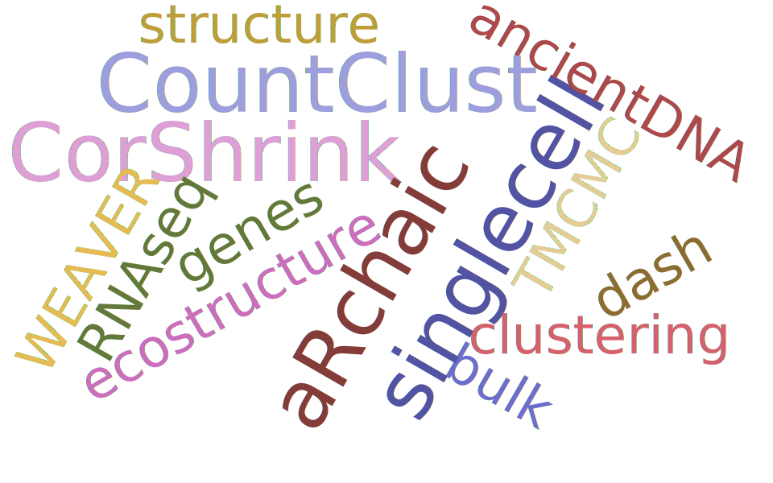

# Hi, this is Kushal

I am a 5th year Ph.D. student in Statistics at the University of Chicago, working in [Matthew Stephens lab](http://stephenslab.uchicago.edu/). My research is primarily aimed at building statistical and machine learning tools to tackle applied problems originating from the fields of genomics, population genetics, ecology and natural language processing. For an overview of my research work, please check my [Research] page. 

I have previously worked as a Visiting Student in [Gottardo Lab, Fred Hutchinson Cancer Research Center](https://www.fredhutch.org/en/labs/profiles/gottardo-raphael.html) during summer 2017 and in [Koeppl Lab](http://www.bcs.tu-darmstadt.de/biocomm/people_1/professor/heinzkoeppl.en.jsp) in summer 2013.

I did my undergraduate an Masters in Statistics at the [Indian Statistical Institute, Kolkata](http://www.isical.ac.in/) where I worked on statistical theory involving Markov Chains for my masters thesis  (under [Dr.Sourabh Bhattacharya](http://www.isical.ac.in/~biru/sb.html))  as well as applied statistical work in nano sciences and medical sciences. 

Below is a word cloud of my research areas, projects and softwares

<td class="left">
    
</td>

<h4>contact</h4>

    

        

            Kushal K Dey 
            <a href="https://galton.uchicago.edu/">Department of Statistics</a> 
            <a href="http://genes.uchicago.edu/">Department of Human Genetics</a> 
            920 E. 58th Strt, CLSC 
            Chicago, IL 60615 
            USA 
	    Email: kkdey@uchicago.edu, kkdey@galton.uchicago.edu 
        

    

